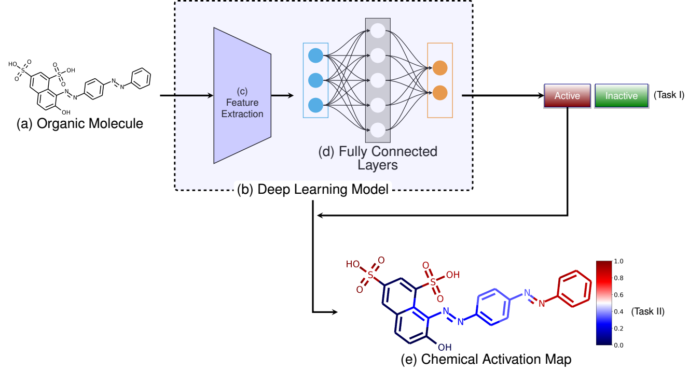

# VisualTox, a deep learning model for chemical toxicity assessment with interpretive visualization

The package provides two major functions:

- Train a Conv+LSTM model with active learning.
- Generate Chemical Activation Map for an example chemical

##  Prerequisites

This package requires:

- [Tensorflow](https://www.tensorflow.org/)
- [scikit-learn](http://scikit-learn.org/stable/)
- [RDKit](https://www.rdkit.org/)